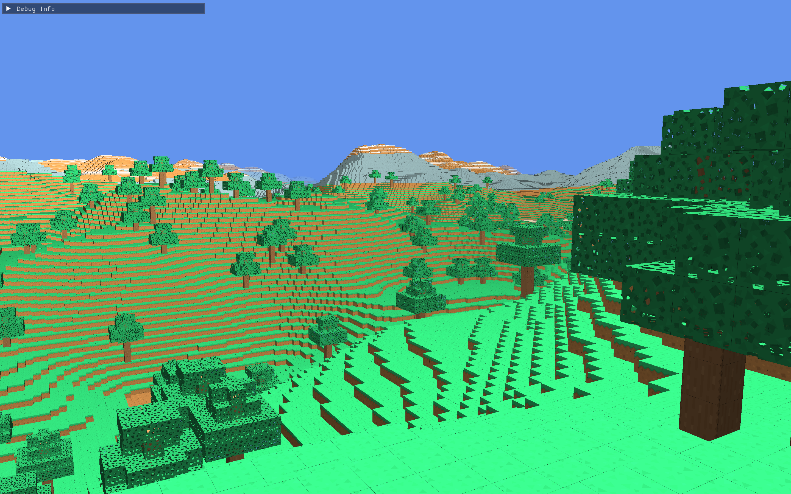

# C++ Voxel Engine

A high-performance voxel engine built from scratch in Modern C++ and OpenGL. 

I've always loved Minecraft and low-level programming, so I decided to combine both to truly understand the systems behind the graphics. By abandoning legacy Object-Oriented patterns and using Data-Oriented Design (DOD), the engine dynamically generates and renders massive procedural worlds at a locked **60+ FPS pushing a 30-chunk circular render distance** (with 32³ block chunks).




### Core Architecture
* **Blazingly Fast O(1) Face Culling:** Uses 64-bit hardware intrinsics (`__builtin_ctzll`) to scan block rows at the hardware level, instantly culling millions of hidden faces before they ever hit the CPU cache.
* **Multithreaded Generation:** A custom thread pool with readers-writer locks (`std::shared_mutex`) completely decouples terrain generation from the render loop, eliminating stuttering.
* **Cache Locality:** Spatial hashing and optimized X-Y-Z memory traversals keep the CPU's L1 cache fed.
* **Procedural Terrain:** Biome generation (temperature/moisture maps) using FastNoiseLite and domain warping.


### Tech Stack
* **Language:** C++17
* **Graphics API:** OpenGL 4.1
* **Libraries:** GLFW, GLAD, GLM, FastNoiseLite, Dear ImGui
* **Developed on:** Apple Silicon (M1)

## How to Build

### 1. Clone the Repository
```bash
git clone https://github.com/lewlinantony/minecraft_clone.git
cd minecraft_clone
```

### 2. Build with CMake
```bash
mkdir build
cd build
cmake ..
make
```

### 3. Run the Engine
```bash
./minecraft_clone
```
